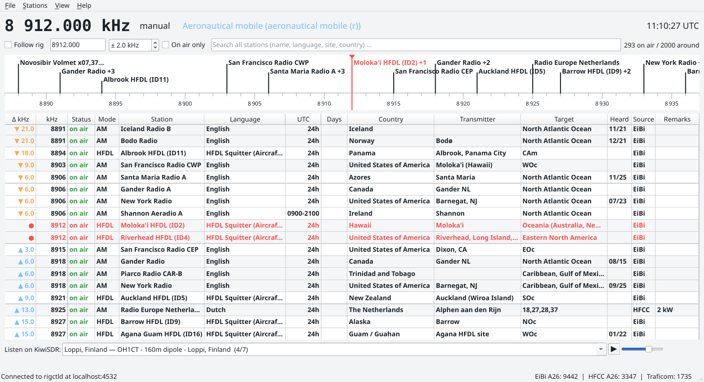

# otd (On The Dial)

*Who is on the frequency I am tuned to?*

otd (On The Dial) is a small desktop program for shortwave listeners. It follows the
VFO of your receiver through Hamlib's `rigctld` and shows which stations are
scheduled on or near that frequency right now: broadcasters, utility stations,
time signals, and oddities such as *The Buzzer* on 4625 kHz. It can also listen
through public KiwiSDR receivers, and it keeps working offline from its local
database, which makes it useful when the internet is down and shortwave is what
is left.



## Download

Ready-made builds from the [GitHub releases](https://github.com/oh2gba/otd/releases), always the newest version, no installation needed:

- Windows 10/11 (64-bit): [otd-windows-x64.zip](https://github.com/oh2gba/otd/releases/latest/download/otd-windows-x64.zip), unzip and start `otd.exe`. Hamlib's rigctld is included.
- Linux (64-bit): [otd-x86_64.AppImage](https://github.com/oh2gba/otd/releases/latest/download/otd-x86_64.AppImage), `chmod +x` and run. Needs the distribution's Hamlib package for rigctld.
- macOS 12 or newer (Apple Silicon and Intel): [otd-macos.dmg](https://github.com/oh2gba/otd/releases/latest/download/otd-macos.dmg).
  The app is not notarized, so on first start right-click it and choose Open. Install rigctld with `brew install hamlib`.
- Checksums: [SHA256SUMS.txt](https://github.com/oh2gba/otd/releases/latest/download/SHA256SUMS.txt). All versions: [releases](https://github.com/oh2gba/otd/releases).

How to hook up the radio: <https://otd.oh2gba.eu/rig.html>

## Features

- Follows the rig via `rigctld` (default `localhost:4532`), reconnects automatically. Also works
  with gqrx's remote control and SDR++'s rigctl server, since the plain rigctl protocol is used.
- Can start `rigctld` for you: pick the rig model, port and baud rate under *File → Settings → Radio*.
- Manual mode: untick *Follow rig* and type a frequency, or start with `--frequency 4625`.
- Live status per entry: **on air** (bold), *maybe* (irregular schedules), off, inactive.
  Evaluated against UTC, including broadcasts crossing midnight, weekday rules
  such as `Mo-Fr`, `1.Sa`, `Last7`, `15Sep`, `MF-15`, validity dates and
  summer/winter-only entries.
- Dial scale: a radio-style scale above the list with the station names at their
  frequencies and the VFO under the pointer. Wheel zooms, dragging looks around, a
  double-click tunes there. *View → Dial* switches it off.
- The list keeps the tuned frequency in the middle, lower frequencies above it and higher
  ones below, like a tuning scale. Entries within the chosen ± kHz range are shown in red.
  The wheel scrolls; Escape or the next VFO move recentres.
- Listen online: *View → Online receiver* shows a KiwiSDR player that follows the tuned
  frequency and the rig's mode through one of the public KiwiSDR receivers (directory
  built in, own addresses welcome). The program identifies itself to the receiver as otd.
- Without a rig: type a frequency into the search box, or use the arrow keys (1 kHz,
  Page Up/Down 5 kHz, with Ctrl 0.1 kHz) while *Follow rig* is off.
- *On air only* toggle, free-text filter (Escape clears it). Column widths follow the
  window width; right-click the header to choose the columns, double-click it to fit them.
- Search: type "buzzer" and the whole database is searched. Several words must all match
  ("bbc english"), a leading "!" excludes a word ("!china english"). On-air hits first with
  their distance from the tuned frequency. Double-click a row to tune the rig to it
  (frequency and mode via rigctld); without a rig the view jumps there instead.
- Mode column (AM, USB, LSB, CW, DRM, RTTY, FAX, HFDL) derived from each source's markers.
- Band indicator: the header shows the allocation of the tuned frequency (49 m broadcast, 40 m amateur,
  aeronautical mobile, maritime mobile, standard time) for the ITU region chosen in Settings.
  Well known unlicensed uses are named too, after the official allocation: pirate and free
  radio bands, the 11 m freeband. The table lives in `data/bandplan.json`. Under
  *File → Settings → Data* the Finnish allocation table from Traficom's open data (CC BY 4.0)
  can be switched on; the header then names the use of each sub-band in Finland.
- Personal list: add your own identifications (Stations menu or right-click), edit, delete,
  import and export as CSV. They appear with source "Mine" and live in the same database.
- Right-click a row for the matching sigidwiki.com page of the mode, or a wiki search for the station.
- Three sources side by side, each switchable: EiBi, HFCC and Aoki. The *Source*
  column tells them apart.
- Codes resolved to names: language, country, transmitter site (including relays,
  e.g. "Moosbrunn (Austria)") and target area.
- Data is stored in a local SQLite database and refreshed at most once a week.
  Refresh requests use `If-Modified-Since`, so an unchanged file costs a single
  tiny 304 response.
- Once a day the program asks the project page for the current version and shows a small
  link above the clock when a newer one exists. The request carries only the program's
  version and platform; the server counts these calls per day, version and platform and
  keeps no addresses or other data. File → Settings switches the check off.
- Everything, including settings, window size and column layout, lives in one SQLite
  file. `--data-dir <dir>` puts it wherever you like (portable mode).

## Data sources

| Source | Status | Notes |
| --- | --- | --- |
| [EiBi](http://www.eibispace.de/) by Eike Bierwirth | included | README states the lists are free to use in third-party software. Thank you, Eike! |
| [HFCC](http://www.hfcc.org/data/) public data files | included | official broadcaster registrations per season, zipped fixed-width text |
| Aoki / Bi Newsletter ([NDXC](http://www1.s2.starcat.ne.jp/ndxc/)) | included | the season zip is located through the index page, since its directory changes |


## Building

Everything builds inside Docker, so nothing needs to be installed on the host
except Docker itself. The resulting binary links against the Qt 6.8 runtime of
Debian 13 (trixie); it runs natively on a trixie/KDE desktop.

```bash
./build.sh            # configure, build and run the unit tests
./build/otd     # run it
```

Options: `--no-test` skips the tests, `--clean` starts from scratch.

Ready-made packages, both produced in Docker as well:

```bash
./package-linux.sh      # dist/otd-<version>-x86_64.AppImage (Ubuntu 22.04 base, Qt 6.8)
./package-windows.sh    # dist/otd-<version>-windows-x64.zip (MinGW cross build, bundles rigctld)
```

The Windows zip ships Hamlib's `rigctld` (LGPL) so users need nothing else;
the AppImage expects `rigctld` from the distribution's Hamlib package.

Without Docker you need CMake ≥ 3.21, Ninja and Qt 6 (Widgets, Network, Sql,
Test) and can build the usual way:

```bash
cmake -S . -B build -G Ninja && cmake --build build && ctest --test-dir build
```

## Running

```bash
./build/otd                         # follow rigctld on localhost:4532
./build/otd --frequency 4625        # manual mode at 4625 kHz
./build/otd --data-dir ./data-local # portable: keep everything here
./build/otd --palette dark          # light or dark colours instead of the desktop's
```

Without a rig: type a frequency into the search box, or use the arrow keys while
*Follow rig* is off (1 kHz, Page Up/Down 5 kHz, with Ctrl 0.1 kHz). *View → Online
receiver* opens the KiwiSDR player.

Settings (rigctld host/port, poll interval, search width, refresh interval,
sources and their URLs) are under *File → Settings* and are stored in the
same `stations.db` as the schedules. Without `--data-dir` that file lives in
`~/.local/share/otd/` on Linux.

`--screenshot <file>` saves a picture of the window after a few seconds and
exits; it exists for documentation.

Note for Wayland users: the window size is restored, but a Wayland compositor
does not let applications choose their position. KWin can remember it for you
via a window rule for "otd".

## Flatpak

`flatpak/eu.oh2gba.otd.yml` builds the app together with Hamlib on the KDE 6.11
runtime, so rigctld is available inside the sandbox:

```bash
flatpak-builder --user --install --force-clean build-flatpak flatpak/eu.oh2gba.otd.yml
flatpak run eu.oh2gba.otd
```

The same manifest is what a Flathub submission needs, together with the AppStream
metainfo in `data/`.

## Web page and source

Web page: <https://otd.oh2gba.eu/>
Source code: <https://github.com/oh2gba/otd>

## Project layout

```
src/core/   parsers (EiBi, HFCC, Aoki, Traficom), schedule evaluation, SQLite store, rigctld client,
            downloaders, band plan, KiwiSDR client and receiver directory, version check (no GUI)
src/app/    Qt Widgets user interface: main window, station model, dial scale, KiwiSDR player, settings
tests/      QtTest unit tests for the core, plus kiwi_probe (manual check of a KiwiSDR connection)
docker/     build images (Debian trixie + Qt 6; Ubuntu 22.04 for the AppImage; mingw for Windows)
data/       desktop entry, icons, AppStream metainfo, band plan table
third_party/miniz   zip extraction (MIT), bundled
```

## License

GPL-3.0-or-later. Bundled miniz is MIT licensed. Schedule data remains the
property of its respective publishers; see *Data sources*.
